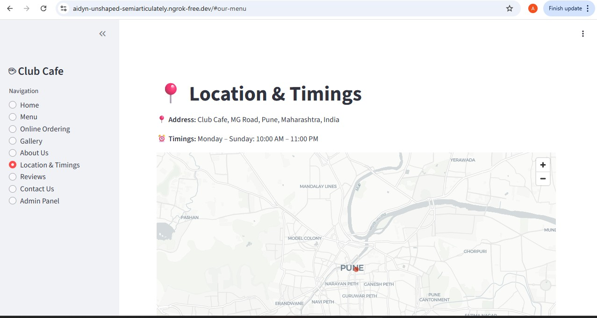
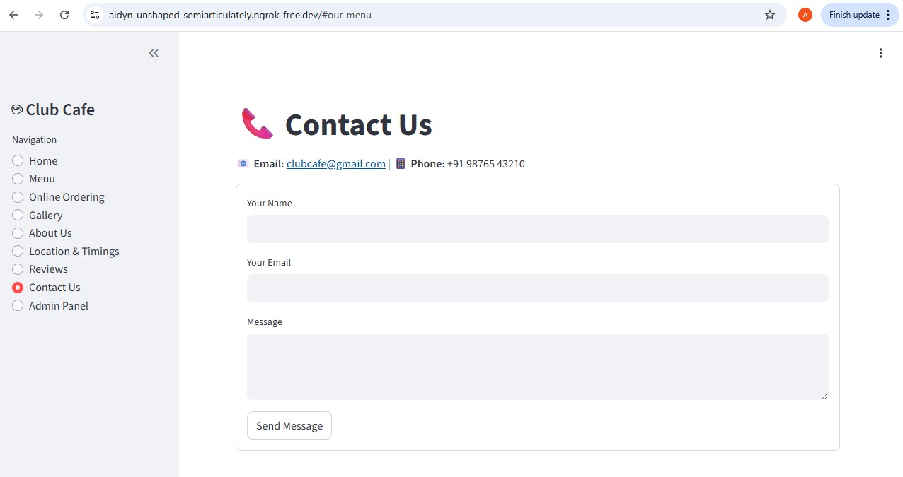
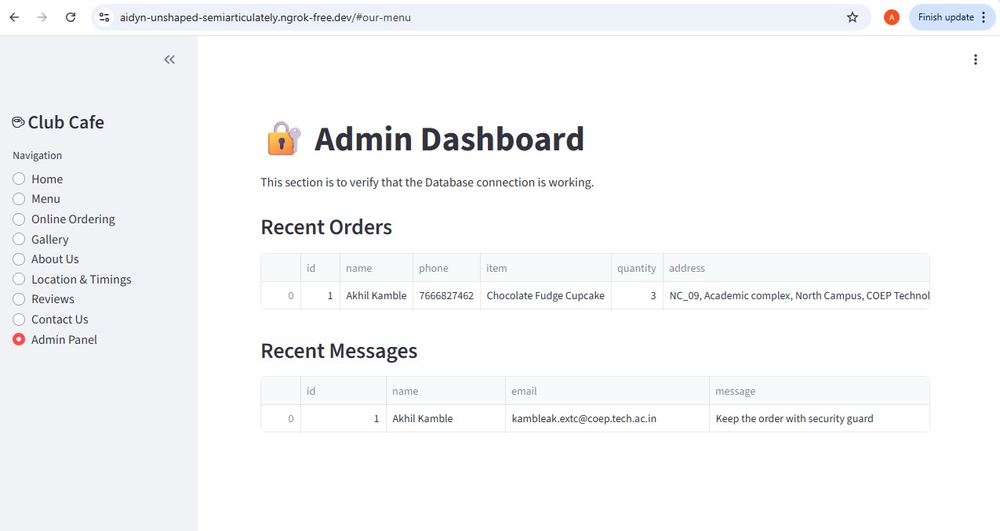

# Club Cafe Management System

A web-based application for managing a cafe's operations.

## Features

* **Frontend:** User-friendly interface built with Streamlit and Custom CSS.
* **Backend:** Python logic handles data processing.
* **Database:** SQLite database stores all orders and "Contact Us" messages.
* **Functionality:** Customers can view the menu, place orders online, and read reviews.


##Screenshots 
###Home Pabe

*A view of the homepage alongwith the sidebar for perticular token.*

### Order Form

*The interface for customizing and placing an order.*

##Locaton and Timing

*Interface to find the location and availabliity of the store.*

### Cotact info

*Contact information so customer can visit.*

### Admin Panel

*The interface to check the database information.*

## Technologies Used

* Python
* SQL (SQLite)
* HTML/CSS
* Streamlit

## How to Run

1.  Ensure you have Streamlit installed:
    ```bash
    pip install streamlit
    ```

2.  Run the application:
    ```bash
    streamlit run club_cafe_app.py
    ```
